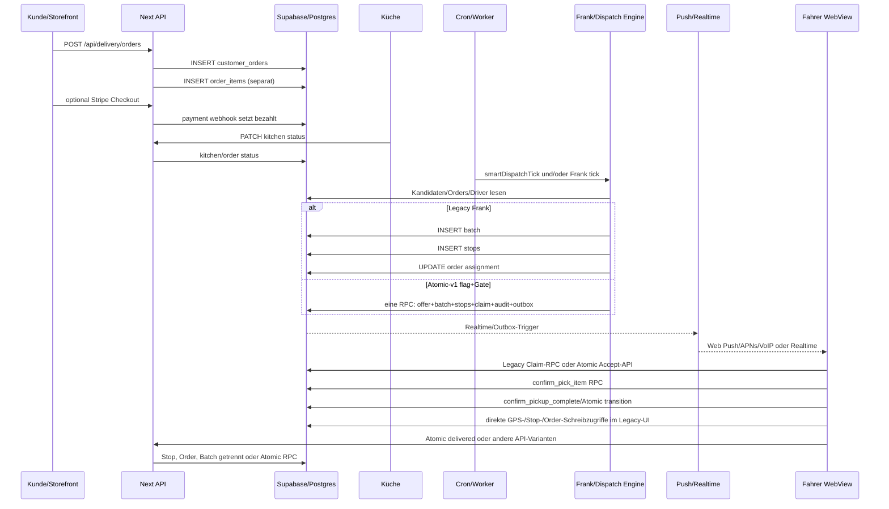
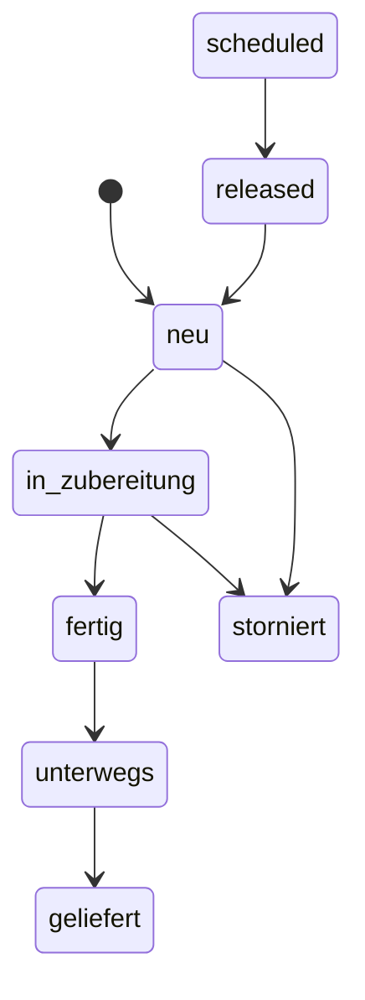
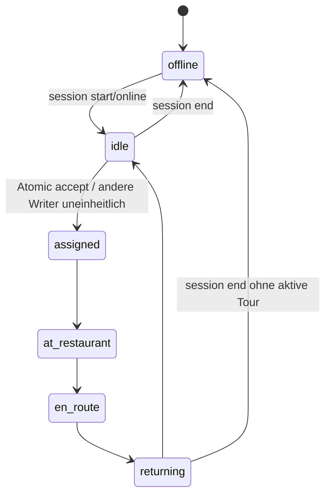
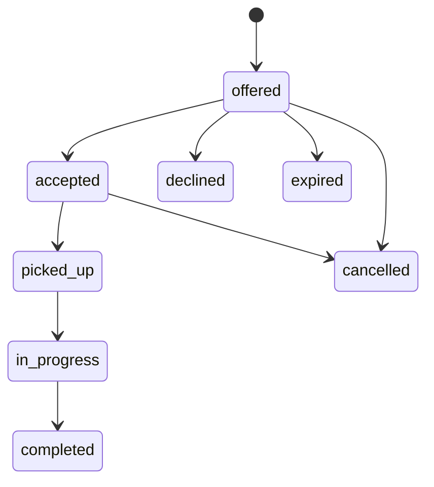
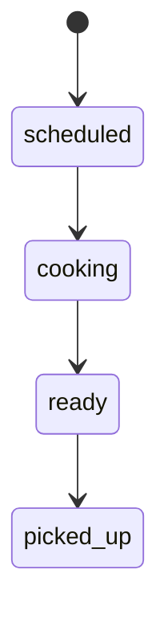
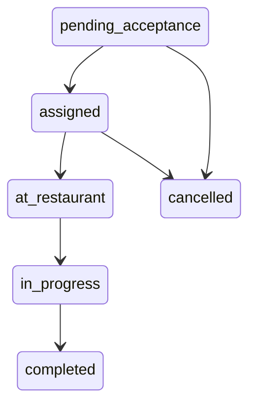
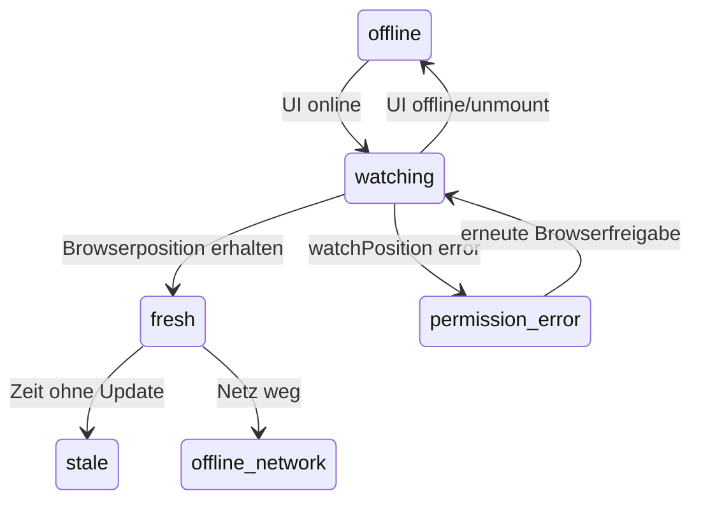
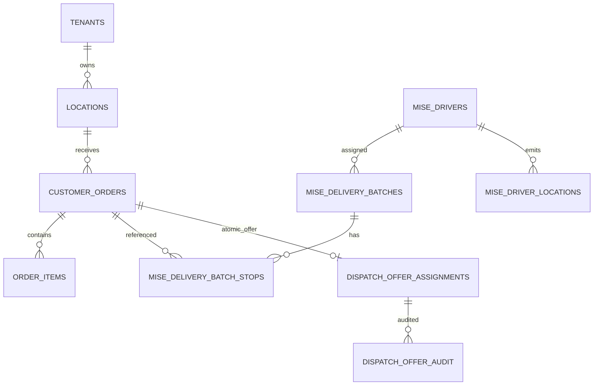

# Forensischer Audit des Mise-Liefersystems

Stand: 2026-07-26  
Audit-Repository: `/Users/eule/mise-backoffice-work`  
Ergänzend untersuchtes Native-Repository: `/Users/eule/mise-driver-app`

## 1. Executive Summary

**BEWIESENE TATSACHE:** Das untersuchte System ist kein einzelner konsistenter
Liefer-Workflow. Es enthält mindestens zwei parallele Batch-/Fahrerwelten
(`delivery_*`/`driver_status` und `mise_delivery_*`/`mise_drivers`), mehrere
Dispatch-Writer (Legacy-DB, Frank-DB-RPC, Frank-JavaScript sowie einen
default-off Atomic-v1-Pfad) und mehrere Client-/API-Wege für Accept, Pick,
Pickup und Delivery. Belege: `scripts/migrations/005_open_batches_view.sql:14-65`,
`lib/frank.ts:128-381`, `app/api/driver/v1/internal/dispatch/route.ts:42-75`,
`app/fahrer/app/client.tsx:1417-1565`.

**BEWIESENE TATSACHE:** Der aktive Legacy-JavaScript-Pfad in `lib/frank.ts`
legt Batch, Stops und Order-Zuweisung in drei separaten PostgREST-Requests an.
Fehler der Stop- und Order-Updates werden nicht geprüft. Derselbe strukturelle
Fehler besteht beim Merge, wo Stops, `mise_batch_id` und `mise_driver_id`
getrennt geschrieben werden. Beleg: `lib/frank.ts:554-587,590-668`.

**BEWIESENE TATSACHE:** Ein atomarer, versionierter Single-Order-Pfad ist im
Repository implementiert, mit Advisory-Xact-Lock, Writer-Gate, aktiver
Assignment-Eindeutigkeit, CAS-Transitions, Outbox und Idempotency. Er ist aber
absichtlich nur bei Feature-Flag und tenant-spezifischer Writer-Election aktiv.
Belege: `scripts/migrations/274_atomic_single_order_offer.sql:35-1000`,
`lib/frank.ts:170-185,518-552`,
`docs/runbooks/P0-ATOMIC-OFFER-SWITCH-INVENTORY.md:1-18`.
Ob Migration 274 in der aktuellen Produktion angewandt und ein Tenant-Gate
aktiv ist, wurde wegen des Verbots produktiver Prüfungen nicht verifiziert.

**BEWIESENE TATSACHE:** Der „intelligente 20-km“-Algorithmus ist deterministisch
und lokal unit-getestet, aber nur zusammen mit Atomic-v1 aktiv. Er nutzt
Luftlinie und statische Geschwindigkeiten, nicht Straßenrouting oder Verkehr.
Seine Formel lautet
`Fahrzeit Fahrer→Pickup + Pickup→Dropoff + 6 Service-Minuten
+ aktive Stopps×8 + Zuweisungen letzte Stunde×2 + ggf. 2 Recency-Minuten`.
Belege: `lib/delivery/intelligent-dispatch.ts:49-60,166-298`,
`lib/frank.ts:290-373`. Der fokussierte Typecheck und der Unit-Test bestanden.

**BEWIESENE TATSACHE:** Die neue Fernorder-Hold-/Korridorlogik existiert in
uncommitted Dateien und ist default-off. 0–3 km werden nicht gehalten,
3–8 km maximal 60 s, 8–15 km 180 s und 15–20 km 300 s. Die in
`decideLongDistanceHold` berechnete `holdUntil` wird in `frank.ts` jedoch nicht
in `dispatch_after` persistiert; Frank protokolliert nur und bewertet beim
nächsten Tick erneut. Küchenauslastung und echte Fahrer-ETA fließen nicht ein.
Belege: `lib/delivery/long-distance-batching.ts:38-55,121-165`,
`lib/frank.ts:188-204`.

**BEWIESENE TATSACHE:** Picking ist serverseitig nicht vollständig geschützt.
`pick-verify` erklärt selbst, dass es nicht prüft, ob alle Artikel vorhanden
sind (`app/api/driver/v1/orders/[id]/pick-verify/route.ts:13-19`). Der
Legacy-Pickdialog erlaubt „Fehlt“ als bestätigten Endzustand und aktiviert
danach „Alles dabei — losfahren“ (`app/fahrer/app/pick-dialog.tsx:35-36,38-49,
150-168`). Die eigentliche RPC-Definition hängt vom migrierten DB-Stand ab;
ihre Produktionsverfügbarkeit wurde nicht geprüft.

**BEWIESENE TATSACHE:** Die Web-Fahrer-App schreibt kritische Zustände direkt
über den Supabase-Browserclient: Fahrer online/offline, GPS, Ankunft, Stops,
Order geliefert. Damit sind Backend-State-Machines im Legacy-Pfad nicht die
alleinige Autorität. Belege: `app/fahrer/app/client.tsx:1353-1391,1435-1485,
1518-1565`.

**BEWIESENE TATSACHE:** GPS im WebView ist ausschließlich
`navigator.geolocation.watchPosition`. Die native Swift-Hülle enthält PushKit
und CallKit, aber keinen `CLLocationManager`, keinen Background-Location-Service
und keine persistente GPS-Outbox. Deshalb beweist das gesetzte iOS
`UIBackgroundModes=location` allein kein Hintergrundtracking. Belege:
`app/fahrer/app/client.tsx:1353-1391`,
`/Users/eule/mise-driver-app/ios-resources/AppDelegate.swift:1-149`,
`/Users/eule/mise-driver-app/ios-template/Info.plist:10-33`.

**BEGRÜNDETE HYPOTHESE:** Die häufigen Betriebsfehler entstehen primär durch
fragmentierte Geschäftslogik, nicht atomare Legacy-Transitions, nicht
beobachtete Fehler und fehlende E2E-/Race-/Device-Tests. Diese Hypothese wird
durch die nachfolgenden Codebelege stark gestützt.

**UNBEKANNT:** aktueller produktiver DB-Migrationsstand, aktive Feature-Flags,
konkrete Cron-Konfiguration des neuen Servers, TestFlight-Build-SHA,
RLS-Zustand der produktiven Tabellen und tatsächliche Geräteberechtigungen.

**EMPFEHLUNG:** Keine Algorithmusoptimierung produktiv aktivieren, bevor ein
Single-Writer, atomare State-Transitions, serverseitige Pick-Invarianten und
ein reproduzierbares Staging mit Race-/Device-E2E nachgewiesen sind.

## 2. Repository Map und Umgebung

| Bereich | Beweisbarer Ist-Zustand |
|---|---|
| Hauptroot | `/Users/eule/mise-backoffice-work` |
| Branch/Commit | `codex/p0-single-writer-atomic-offer` / `f14afea523f766603fe49c8cba716086abe72b37` |
| Native Root | `/Users/eule/mise-driver-app`, `main` / `afc25f88deac18658316f9db531e878f14c73442` |
| Web/Backend | Next.js 14.2.18, React 18.3.1, TypeScript 5.6.3; `package.json` |
| DB/Realtime | Supabase JS 2.103, Postgres-Migrationen, Supabase Realtime |
| Mobile | Capacitor 6 WebView; iOS-PushKit/CallKit; Android-Dependency vorhanden, Android-Projekt nicht versioniert |
| Routing | Google Geocoding/Directions in `lib/google-maps.ts`; Haversine-Fallback |
| Push | Web Push/VAPID, APNs Alert, APNs VoIP/PushKit/CallKit, DB-Outbox |
| Scheduling | Vercel-Cron `vercel.json`; zusätzlicher interner Frank-Tick laut Route-Kommentar/Deploy-Doku |
| Paketmanager | `package-lock.json` und `pnpm-lock.yaml` gleichzeitig vorhanden |
| Deployment | `Dockerfile`, Vercel-Konfiguration; Native GitHub Actions erzeugt iOS-Projekt und lädt TestFlight hoch |
| Tests | einzelne TS-Assertionstests und SQL-Vertragstests; kein einheitlicher `test`-Script im Haupt-`package.json` |

Vor Audit vorhandene, nicht überschriebenen Änderungen:

- `M docs/task-packets/P1-INTELLIGENT-15KM-ELIGIBILITY.md`
- `M lib/delivery/intelligent-dispatch.ts`
- `M lib/frank.ts`
- `M scripts/tests/intelligent-dispatch.test.ts`
- `M tsconfig.p0.json`
- untracked: Long-Distance-Modul/Test/Doku, Migration 275 und
  `tsconfig.p0.tsbuildinfo`.

Native: zahlreiche untracked Plan-/Design-/Eval-Dateien und `A eas.json`.

Relevante Umgebungsvariablen wurden nur dem Namen nach erfasst:
Supabase URL/Anon/Service Role, interne Cron-/BISS-Tokens, Google Maps,
VAPID, APNs Alert/VoIP, Stripe, Mail/Resend, AWS, Twilio/WhatsApp sowie
`P0_ATOMIC_OFFER_ENABLED`, `P0_ATOMIC_OFFER_EXPIRY_ENABLED`,
`P0_INTELLIGENT_20KM_ENABLED`, `P0_SMART_LONG_DISTANCE_BATCHING_ENABLED`.
Werte wurden nicht gelesen oder ausgegeben.

Fehlende/andere Repositories: Die Dokumentation nennt Storefront/POS und ein
separates „mise-os“. Deren vollständiger Code ist im Audit-Root nicht
nachweisbar. Die Native-App lädt lediglich die Web-URL.

## 3. Architektur und End-to-End-Datenfluss

### Tatsächliche Module

1. Order-Erzeugung: `app/api/delivery/orders/route.ts`,
   `app/t/[token]/storefront.tsx`, externe Adapter unter
   `lib/external-orders/`.
2. Zahlung: `app/api/checkout/create-session/route.ts`,
   `app/api/stripe/webhook/route.ts`, `app/order/paid/page.tsx`.
3. Kitchen: `app/api/delivery/kitchen/[orderId]/status/route.ts`,
   `lib/delivery/kitchen-sync.ts`, diverse direkte UI-Schreibpfade.
4. Dispatch A: `lib/delivery/dispatch-engine.ts` über
   `smartDispatchTick()` im großen Cron.
5. Dispatch B: `lib/frank.ts` über
   `/api/driver/v1/internal/dispatch-tick`.
6. Dispatch C: DB-RPC `fn_frank_assign_nearest_driver` über
   `/api/driver/v1/internal/dispatch`.
7. Atomic-v1: Migration 274 und `lib/delivery/atomic-*.ts`.
8. Fahrer-Web-App: `app/fahrer/app/page.tsx`, `client.tsx`,
   `pick-dialog.tsx`, `delivery-view.tsx`.
9. Native: Capacitor-WebView plus `AppDelegate.swift`.
10. Recovery: `lib/delivery/recovery.ts`, `scanStaleBatches`.

### Sequenzdiagramm des IST-Pfads



### Netzwerkaufrufe

- Storefront → `/api/delivery/orders`, `/api/checkout/create-session`.
- Stripe → `/api/stripe/webhook`.
- Cron → `/api/cron/smart-dispatch`; separater interner POST
  `/api/driver/v1/internal/dispatch-tick`.
- Fahrer v1: Auth, `/orders/active`, `/orders/accept`,
  `/orders/:id/pick-verify`, `/picked-up`, `/delivered`,
  `/me/position`, `/offers/ack`, `/offers/transition`.
- Browser → Supabase REST/RPC/Realtime direkt.
- Worker → Google Geocoding/Directions, APNs, Web Push.
- Native → Push token APIs und unauthentifizierter `push-debug`-Beacon.

### Datenbankänderungen im Kernfluss

`customer_orders`, `order_items`, `kitchen_timings`, `mise_drivers`,
`driver_status`, `mise_delivery_batches`, `mise_delivery_batch_stops`,
Legacy `delivery_batches`/`delivery_batch_stops`, `mise_frank_decisions`,
`mise_push_outbox`, optional `dispatch_offer_assignments`,
`dispatch_offer_audit`, `dispatch_offer_transition_requests`,
`mise_driver_locations`.

### Realtime-/Push-Ereignisse

- Fahrer-Web-App hört auf beide Batch-/Stop-Tabellen und `driver_status`
  (`client.tsx:1417-1429`).
- Küchenstatus hört auf `customer_orders` (`client.tsx:1280-1295`).
- DeliveryView hört irrtümlich nur auf Legacy
  `delivery_batch_stops` (`delivery-view.tsx:133-155`).
- APNs VoIP trägt `batch_id`, `restaurant_name`, `body`; CallKit Answer
  foregroundet nur, akzeptiert serverseitig nicht
  (`AppDelegate.swift:82-147`).
- Atomic-v1 besitzt App-ACK (`offers/ack`) und Outbox.
- Legacy-Push besitzt keine durchgängig belegte App-Quittierung.

### Source of Truth

**BEWIESENE TATSACHE:** Es gibt keine einzelne Source of Truth:

- Order: `customer_orders`, aber mit Legacy- und Mise-Assignment-Spalten.
- Fahrer: `driver_status` und `mise_drivers`.
- Zuweisung: Legacy Batch/Stops, Mise Batch/Stops und optional
  `dispatch_offer_assignments`.
- UI schreibt teilweise direkt in mehrere Tabellen.

Alte Events können im Legacy-Pfad neuere Zustände überschreiben, weil viele
Updates weder erwarteten Vorzustand noch Version prüfen. Beispiel:
`orders/accept/route.ts:52-55`, `picked-up/route.ts:64-79`,
`delivered/route.ts:72-105`.

### Hängepunkte

Order-Items-Insert nach Order-Insert; Geocoding; Writer-Gate-Read; kein Fahrer;
Hold ohne Persistenz; Teilfehler bei Batch/Stops/Order; Push-Outbox/APNs;
Tokenregistrierung; Realtime-Verlust; fehlende Pick-RPC; direkte Clientrechte;
Pickup-Mehrfachschritte; Routinganbieter; Recovery-Teilupdates; stale GPS.

## 4. Rekonstruierte Zustandsmaschinen

### A. Order

Im Code vorkommende deutsche Zustände sind u.a. `neu`, `bestätigt`,
`in_zubereitung`, `fertig`, `unterwegs`, `geliefert`, `storniert`; daneben
englische/alternative Varianten (`pending`, `scheduled`, `released`,
`preparing`, `ready`, `cancelled`). Eine zentrale Enum/Transitionstabelle ist
nicht belegt.



Validierung ist über API, UI, RPC und Trigger verteilt. Legacy-Updates sind
überwiegend ohne CAS. Atomic-v1 besitzt versionierte Transitions.

### B. Driver



`client.tsx` nutzt jedoch hauptsächlich `driver_status.ist_online`, während
Frank `mise_drivers.active/state` filtert. Synchronisation ist nicht
transaktional.

### C. Assignment



Dieses saubere Modell gilt nur für Atomic-v1. Legacy kennt primär
`pending_acceptance`, `assigned`, `at_restaurant`, `in_progress`,
`completed`, `cancelled` ohne einheitliche Version.

### D. Kitchen



`kitchen/[orderId]/status` prüft nur Login, nicht sichtbar eine Küchenrolle
oder Location-Autorisierung (`route.ts:16-37`). `mark*`-Implementierung und
DB-RLS entscheiden über weiteren Schutz.

### E. Route/Trip



Legacy-UI kann Stopps lokal „zurückstellen“ und bestimmt dadurch `nextStop`
(`delivery-view.tsx:74-75,287-299`), obwohl der Zielprozess die Reihenfolge
serverseitig bestimmen soll.

### F. GPS/Connectivity



Keine Sequenznummer, kein Gerätezeitstempel und kein Schutz gegen ältere
Punkte ist in `/me/position` vorhanden; der Server setzt `recorded_at=now`.

## 5. IST-Dispatch-Algorithmus

### Entry Points und Writer

- `smartDispatchTick()` im 2-Minuten-Großcron
  (`app/api/cron/smart-dispatch/route.ts:462`).
- Frank JS über internen Token
  (`app/api/driver/v1/internal/dispatch-tick/route.ts:16-27`).
- Frank DB-RPC über separaten internen Endpunkt
  (`internal/dispatch/route.ts:42-75`).
- DB-Trigger-Writer laut Migration-274-Runbook.

### Frank Legacy Pseudocode

```text
orders = älteste 50 Lieferorders
         status in neu/in_zubereitung/fertig
         ohne mise_driver_id und mise_batch_id
für order:
  location laden
  tenant writer gate lesen; fremden Writer überspringen
  optional long-distance Entscheidung (default-off; nur loggen/return)
  fehlende Kundenkoordinaten via Google geocoden
  Fahrer = aktive tenant Fahrer, state != offline
  Legacy: fehlendes GPS zulassen; sonst Radius Fahrer→Restaurant prüfen
  für Fahrer:
    einen offenen Batch suchen
    Slot + gleicher Pickup + nahe Dropoff/Korridor prüfen
    bei Match: Stops und Order-Links getrennt schreiben; return bundled
  bei Spar-Strategie bis 180 s anhand Orderalter warten
  wenn Atomic+Intelligent flags:
    GPS freshness, state, capacity, deadline und Score prüfen
  sonst:
    Fahrer mit kleinster Haversine-Distanz wählen; fehlendes GPS = 999 km
  Legacy: Batch, Stops, Orderlinks getrennt schreiben
  Atomic: eine versionierte RPC ausführen
```

### Faktorstatus

| Faktor | Status | Beweis |
|---|---|---|
| Fahrer online/aktiv | vorhanden, inkonsistent | `frank.ts:384-404` |
| GPS-Frische | nur intelligenter default-off Pfad | `intelligent-dispatch.ts:212-220` |
| Legacy ohne GPS | fehlerhaft zugelassen | `frank.ts:239-243` |
| Radius | Legacy Fahrer→Pickup; Intelligent Pickup→Kunde | `frank.ts:239-243`; Intelligent `197-201` |
| Kapazität | Legacy feste Bike 2/Car 4 + Strategy-Bonus | `frank.ts:99-109,422-423` |
| ETA | Intelligent statische Luftlinie | `intelligent-dispatch.ts:228-268` |
| Verkehr/Straßen | fehlt bei Auswahl; Google erst nach Pickup | `frank.ts:678-742` |
| Küchenlast/Prep | fehlt im Frank-Score |
| Deadline | nur Intelligent/Long-distance | entsprechende Module |
| Fairness | nur Intelligent, Decision-Count | `intelligent-dispatch.ts:254-268` |
| Tie-Break | lexikalische Driver-ID | `intelligent-dispatch.ts:289-296` |
| Bundling | gleicher Pickup + Dropoff-Nähe oder optional Korridor | `frank.ts:407-493` |
| Mehrere Stores | Tenant-Membership; Merge verlangt gleichen Pickup |
| Reassignment-Churn | Atomic-Version schützt; Legacy kein einheitlicher Schutz |
| Atomarer Claim | Atomic vorhanden/default-off; Legacy fehlt |
| Idempotenz | Atomic vorhanden; Legacy fehlt |
| Audit | `mise_frank_decisions`, Atomic-Audit; Fehler des Legacy-Logs ignoriert |

## 6. Hold- und Küchenfreigabe

**BEWIESENE TATSACHE:** Drei verschiedene Wartekonzepte existieren:

1. Tenant-Strategie `spar`: 180 s rein anhand Orderalter
   (`frank.ts:102-109,281-288`).
2. Uncommitted Fernorder-Policy: 0/60/180/300 s, Deadline-Override, hard cap
   20 km (`long-distance-batching.ts:38-55,114-165`).
3. Geplante Bestellungen: Küche startet
   `scheduled_at-estimated_prep_min`, Cron schaut 30 Minuten voraus
   (`lib/delivery/scheduled.ts:40-100`).

Die Fernorderlogik berücksichtigt keine aktuelle Küchenauslastung,
Fahrer-ETA, Folgeorder-Wahrscheinlichkeit oder Straßenroute. Die Hold-Zeit ist
deterministisch, nicht zufällig. Sie ist an `createdAt` gebunden, wird aber im
aktuellen `frank.ts` nicht persistiert. Ein Restart verliert deshalb keinen
absoluten Startzeitpunkt, sofern `created_at` unverändert ist, aber es gibt
keinen dauerhaften Hold-Datensatz/Watchdog für diese Policy.

Die geplante Küchenfreigabe ist persistent und hat einen Cron, fängt aber eine
fehlende Migration still als `{released:0}` ab (`scheduled.ts:78-86`).

## 7. GPS- und Live-Tracking-Audit

### Client

- Berechtigung wird implizit durch Browser `watchPosition` angefordert.
- High accuracy, `maximumAge=5000`, `timeout=15000`; Push-Drossel 15 s.
- Übertragung erfolgt direkt nach `driver_status`, nicht über
  `/api/driver/v1/me/position`.
- Cleanup des Watchers ist vorhanden.
- Keine Accuracy-Filterung, Sprungerkennung, Gerätezeit, Sequenznummer,
  Offline-GPS-Queue oder Reconnect-Replay im gezeigten Pfad.
- Tracking startet, sobald UI-`isOnline` wahr ist, unabhängig von aktiver Tour.

### Backend

`/me/position` validiert nur Zahlen/Weltgrenzen, fügt History ein und aktualisiert
zwei Current-State-Tabellen (`route.ts:16-60`). Fehler der drei DB-Writes werden
nicht geprüft. Gerätetimestamp fehlt; Serverzeit gewinnt. Ältere Netzpakete
können daher eine neuere Position überschreiben.

Migration 275 würde RLS und 30-Tage-Cleanup bereitstellen, ist aber untracked;
ein Scheduler-Aufruf für die Cleanup-Funktion wurde im untersuchten Code nicht
gefunden. Der Kommentar behauptet einen Produktionsjob, ist kein Beweis.

### Native Plattform

iOS besitzt Location-Purpose-Strings und Background-Mode im Template/CI.
`AppDelegate.swift` implementiert jedoch nur Push/CallKit. Capacitor
Geolocation ist grundsätzlich ein Vordergrund-Web-Plugin; kein nativer
Background-Tracker ist im Repository belegt. Ein Android-Projekt/Manifest ist
nicht versioniert, sondern wird erst per `cap add android` generiert.

### Zuverlässigkeitsmatrix

| Fall | aktuelles Verhalten | Risiko/Test |
|---|---|---|
| App offen | Browser watcher, ca. max 15-s-Write | grundsätzlich aktiv; Device-Test fehlt |
| minimiert | WebView/Browser kann gedrosselt/suspendiert werden | hoch; kein Realgerät-Test |
| Bildschirm gesperrt | nicht durch nativen Location-Code belegt | hoch |
| App beendet | kein Location-Code ausführbar | P0/P1 für Live-ETA |
| Geräteneustart | kein Auto-Start belegt | hoch |
| Internet weg | UI-Actionqueues existieren, GPS-Queue nicht belegt | Punkte gehen verloren |
| Energiesparmodus | unbekannt | Device-Test fehlt |
| nur „während Nutzung“ | Hintergrund nicht zuverlässig | hoch |
| Always-Berechtigung | Plist vorhanden, Nutzung nicht implementiert | nicht angeschlossen |
| GPS aus/abgelehnt | `gpsOk=false`; keine operative Eskalation | mittel/hoch |
| ungenau | Accuracy wird im Web-Pfad nicht gespeichert/gefiltert | Fehlzuweisung |
| alte App | keine App-Version in GPS-Telemetrie | unbekannt |

## 8. Datenbank, Realtime und Sicherheit

### Vereinfachtes ER-Modell



Migration 274 definiert partielle Unique-Constraints für aktive Assignments
und CAS-RPCs. Der Legacy-Pfad nutzt diese Invarianten nicht zwingend.
Migration 005s `assign_to_driver` schreibt bewusst beide Welten in einer
PL/pgSQL-Transaktion, setzt Orderstatus aber sofort auf `unterwegs`
(`005:109-169`) und bildet damit eine andere State Machine.

**Sicherheitsbefunde:**

- Driver-v1-APIs authentifizieren Bearer-Tokens und prüfen Ownership.
- Legacy-Web-App schreibt mit Browser-Supabase direkt. Die tatsächliche
  Sicherheit hängt vollständig von produktiver RLS ab; dieser Stand ist lokal
  nicht beweisbar.
- Kitchen-Statusroute prüft Login, aber keine explizite Rolle/Location.
- `push-debug` nimmt Body an und loggt ihn; Native-Beacon ist unauthentifiziert.
- `AppDelegate` speichert Access-/VoIP-Token in `UserDefaults`, nicht Keychain.
- Keine Standort-Attestation oder Plausibilitätsfilterung ist belegt.

## 9. Push, Realtime und Synchronisierung

Push-Kanäle sind vorhanden, aber fragmentiert. Native PushKit registriert ein
Token, versucht fünfmal im 10-s-Abstand den Upload und prüft die HTTP-Antwort
nicht (`AppDelegate.swift:69-127`). CallKit Answer beendet nur den Call und
vertraut auf `visibilitychange`/Reload (`client.tsx:1342-1351`).

Die Web-App besitzt zwei inkompatible Offline-Queue-Repräsentationen unter
demselben LocalStorage-Key `mise_offline_queue`:

- typed `{type,payload,timestamp,attempts}` in
  `offline-sync-manager.tsx:12-55`;
- raw `{url,method,body,headers,queuedAt}` in
  `offline-sync-banner.tsx:7-41`.

Beide Leser interpretieren dieselben Daten unterschiedlich. Server-
Idempotency für Legacy-Replays ist nicht belegt. Der Manager verwirft Aktionen
nach fünf Fehlversuchen (`offline-sync-manager.tsx:112-147`).

„Fahrer kann nicht ablehnen“ ist nicht vollständig backendkontrolliert:
CallKit bietet systembedingt Auflegen (`AppDelegate.swift:144-148`), Atomic-v1
unterstützt explizit `decline`, und ein separates Driver-App-Decline-API
existiert. Reguläre UI kann den Button verstecken, aber Ausnahmegründe und
verbindliche Backend-Policy sind nicht als eine zentrale Regel implementiert.

## 10. Race-, Fehler- und Ausfallanalyse

1. **P0:** Legacy-Assignment nicht atomar (`frank.ts:554-587`).
2. **P0:** Legacy-Merge nicht atomar und ohne CAS (`590-668`).
3. **P0:** mehrere Writer/Dispatcher; Election schützt nur migrierten,
   aktivierten Atomic-Pfad.
4. **P0:** kritische Driver-UI schreibt direkt in DB und kann Backendregeln
   umgehen (`client.tsx:1435-1565`).
5. **P0:** Pick-Vollständigkeit/Missing nicht serverseitig erzwungen
   (`pick-verify:13-19`, `pick-dialog:150-168`).
6. **P1:** Legacy-Dispatch akzeptiert Fahrer ohne GPS (`frank.ts:239-243`).
7. **P1:** `/me/position` prüft DB-Fehler und Reihenfolge nicht.
8. **P1:** Recovery schreibt mehrere Tabellen getrennt und enthält mehrere
   geschluckte Fehler (`recovery.ts`).
9. **P1:** Offline-Queues teilen einen Schlüssel bei inkompatiblem Format.
10. **P1:** Native Hintergrund-GPS ist nicht implementiert.
11. **P1:** `dispatchTick` prüft den Order-Select-Fehler nicht und ein Fehler
    in `dispatchOrder` beendet die Schleife (`frank.ts:128-153`).
12. **P1:** Delivery-Endpoint setzt Stop und Order vor der Prüfung offener
    Stops getrennt; Fehler werden ignoriert (`delivered:72-108`).
13. **P1:** Pick-Verify ignoriert Updatefehler (`pick-verify:59-77`).
14. **P2:** zahlreiche stille Catch-Blöcke; keine Correlation-ID.
15. **P2:** Long-distance-Hold wird nicht persistent geschrieben.
16. **P2:** Realtime mischt Legacy-/Mise-Tabellen und kann Vollreload-Stürme
    erzeugen.
17. **P2:** Hardcoded Location-ID in `delivery-view.tsx:274`.
18. **P2:** Route wird erst nach Pickup berechnet; Auswahl ist nicht
    straßen-/verkehrsbasiert.

## 11. Tests und Builds

| Befehl | Verzeichnis | Ergebnis |
|---|---|---|
| `git diff --check` | Hauptrepo | Exit 0 |
| `npx tsc -p tsconfig.p0.json --noEmit --pretty false` | Hauptrepo | Exit 0 |
| `npx tsx scripts/tests/atomic-lifecycle-contract.test.ts` | Hauptrepo | Exit 0 |
| `npx tsx scripts/tests/atomic-offer-client-state.test.ts` | Hauptrepo | Exit 0 |
| `npx tsx scripts/tests/intelligent-dispatch.test.ts` | Hauptrepo | Exit 0 |
| `npx tsx scripts/tests/long-distance-batching.test.ts` | Hauptrepo | Exit 0 |
| `npm run lint` | Hauptrepo | Exit 1; interaktive ESLint-Erstkonfiguration |
| `npm run build` | Hauptrepo | manuell beendet nach >2 min ohne Fortschritt; Warnung: ungültige `turbopack`-Option |
| `./scripts/verify-fast.sh` | Native | Exit 1; Pflichtdateien fehlen, Validator scannt ungültige JSON5-Dateien in `node_modules` |

Keine Produktions-, Staging-, SQL-, Push-, Order- oder Device-Prüfung wurde
ausgeführt.

### Abdeckungsmatrix

| Szenario | Status |
|---|---|
| Atomic Contract/Client Retry | vorhanden und bestanden |
| Intelligent radius/stale/capacity/deadline/fairness | vorhanden, pure Unit-Tests bestanden |
| Long-distance Hold/Korridor | vorhanden, pure Unit-Tests bestanden |
| Ein Order/ein Fahrer E2E | fehlt |
| mehrere Fahrer/eine Order | nur Pure-Scoring |
| zwei Worker gleichzeitig | SQL-Skripte vorhanden, nicht ausgeführt (keine isolierte DB) |
| App killed/background GPS | fehlt |
| Push nicht angekommen | fehlt |
| Pick missing/all orders | fehlt |
| Cancel während Hold | fehlt |
| Küchenfreigabe doppelt | fehlt |
| Event out-of-order | fehlt |
| Serverrestart | fehlt |
| alte GPS-Punkte | fehlt |
| zwei Stores/ein Fahrer | fehlt |
| alte App/neues Backend | fehlt |

## 12. Observability

Vorhanden sind Decision-/Eventtabellen, Atomic-Audit, Push-Debug und viele
`console.*`-Logs. Nicht als durchgängiges System belegt sind:
Correlation-ID, strukturierte Traces, zentrale Error-Tracking-Plattform,
Duplicate-Assignment-Alarm, app-version/platform-bezogene Fehlerrate,
GPS-Permission-/Background-Telemetrie, Push accepted→received→ACK-Ledger im
Legacy-Pfad sowie Gründe für alle nicht gewählten Fahrer.

Viele Fehler bleiben unsichtbar, weil Supabase-Ergebnisse nicht auf `error`
geprüft oder Catch-Blöcke leer sind. Der große Cron ersetzt Fehler häufig durch
Nullresultate, wodurch operativ „erfolgreiche“ Ticks mit ausgefallenen
Subsystemen möglich sind.

## 13. Anforderungs- und Reifegradmatrix

| ID | Bereich | Anforderung | Status | Code-/Testbeweis | Risiko | Ursache | Maßnahme | Größe | Prio | Confidence |
|---|---|---|---|---|---|---|---|---|---|---|
| R1 | Order | zuverlässig erzeugen | TEILWEISE IMPLEMENTIERT | Orders/Items getrennt; `orders/route.ts:54-91` | Teilorder | keine Transaktion | atomare Create-RPC | M | P1 | hoch |
| R2 | Dispatch | genau eine Zuweisung | IMPLEMENTIERT ABER DEFEKT | Legacy getrennte Writes; Atomic default-off | doppelt/verloren | Multiwriter | Single Writer aktivieren nach Staging | L | P0 | hoch |
| R3 | Fahrer | beste automatische Wahl | TEILWEISE IMPLEMENTIERT | Intelligent pure scorer, flags | falsche Wahl | Luftlinie/default-off | Routing-ETA nach Korrektheitsgate | L | P1 | hoch |
| R4 | Ablehnung | keine normale Ablehnung, sichere Ausnahmen | TEILWEISE IMPLEMENTIERT | Decline-Pfade, keine zentrale Policy | Betriebs-/Safety-Konflikt | Regeln ungeklärt | Exception State Machine | M | P1 | hoch |
| R5 | Bundling | kompatible Orders | IMPLEMENTIERT ABER DEFEKT | Legacy proximity; uncommitted corridor | Qualität/Verspätung | keine Live-ETA | insertion feasibility | L | P1 | hoch |
| R6 | Hold | dynamisch und sicher | TEILWEISE IMPLEMENTIERT | drei Hold-Systeme | zu früh/spät | fragmentiert | eine persistente Deadline-Policy | L | P1 | hoch |
| R7 | Pick | alle zugewiesenen Orders vollständig | IMPLEMENTIERT ABER DEFEKT | Client-only Vollständigkeit | Fahrt ohne Ware | Backend-Invariante fehlt | atomare Batch-Pick-RPC | M | P0 | hoch |
| R8 | GPS | Foreground | TEILWEISE IMPLEMENTIERT | Browser watcher; kein Fehlercheck | stale/falsch | Direktwrite | API+sequence+filter | M | P1 | hoch |
| R9 | GPS | Background/killed | VORHANDEN ABER NICHT ANGESCHLOSSEN | Plist ja, nativer Tracker nein | Trackingausfall | Capability ohne Code | natives Modul + Device-E2E | L | P1 | hoch |
| R10 | Push | zuverlässig/ACK | TEILWEISE IMPLEMENTIERT | mehrere Kanäle; Atomic ACK | Tour übersehen | fragmentiert | kanonisches Ledger | L | P1 | hoch |
| R11 | Recovery | Restart/Race sicher | IMPLEMENTIERT ABER DEFEKT | getrennte Writes, stille Fehler | falsche Freigabe | kein CAS Legacy | versionierte Recovery | L | P0 | hoch |
| R12 | Realtime | Recovery nach Verlust | TEILWEISE IMPLEMENTIERT | subscriptions + reload | stale UI | Dualmodell | server snapshot + version | M | P1 | hoch |
| R13 | Audit | Auswahl nachvollziehbar | TEILWEISE IMPLEMENTIERT | Decisions/Atomic audit | keine vollständige Erklärung | Legacy-Logging | Reason codes pro Kandidat | M | P2 | hoch |
| R14 | Manual | sichere Notfallsteuerung | TEILWEISE IMPLEMENTIERT | `assign_to_driver`, Adminpfade | State-Sprung | eigene State Machine | versionierter Override | L | P1 | mittel |
| R15 | Tests | Race/E2E/Device | FEHLT | nur Pure-/Contracttests | Regression | kein Staging | Simulation+Device suite | XL | P0 | hoch |
| R16 | Security | serverseitige Autorisierung | IMPLEMENTIERT ABER DEFEKT | direkte Browserwrites, Kitchen role gap | Manipulation | RLS-Abhängigkeit | API-only Mutations/RLS-Audit | L | P0 | hoch |
| R17 | Observability | SLO/Alerts/Tracing | TEILWEISE IMPLEMENTIERT | Logs/Tabellen, kein End-to-End Trace | unsichtbare Fehler | heterogen | canonical telemetry | L | P1 | hoch |
| R18 | 20 km | kontrolliert möglich | TEILWEISE IMPLEMENTIERT | scorer+hold uncommitted/default-off | falsche ETA | Luftlinie | erst Replay/Shadow | L | P2 | hoch |

## 14. Root-Cause-Bericht

1. Das System wird nicht fertig, weil neue Funktionen auf mehrere historisch
   gewachsene, nicht vereinheitlichte Zustands- und Writerpfade gesetzt wurden.
2. Hauptproblem ist die Kombination aus fragmentierter Geschäftslogik,
   fehlender einheitlicher State Machine, Legacy-Races, direkter Clientlogik,
   fehlenden realistischen Tests, GPS-Plattformlücken, Observability- und
   Umgebungsproblemen.
3. Fünf größte Ursachen:
   - mehrere Writer und parallele Datenmodelle;
   - nicht atomare Legacy-Mutationen;
   - UI/Client als Business-Logic- und Schreibautorität;
   - kein reproduzierbares Staging/Race-/Device-E2E;
   - geschluckte Fehler und fehlender End-to-End-Audit.
4. Erhalten: Order-/Item-Grundmodell, Atomic-v1-Entwurf, pure Scorer,
   PushKit/CallKit-Grundlage, vorhandene Realtime-/Adminansichten.
5. Reparieren: Writer-Election, Legacy-Transitions, Pick/Pickup,
   Recovery, Push ledger, GPS transport/security.
6. Ersetzen/ablösen: direkte kritische Browserwrites, doppelte Offlinequeues,
   parallele Dispatch-Autoritäten.
7. Reihenfolge: Inventur/Staging → DB-Invarianten/Single Writer → canonical
   API/State Machines → Pick/Recovery → Push/GPS → deterministic baseline →
   Routing/20-km-Hold → UI/Operations → Canary.
8. Nicht parallel ändern: DB-State-Machine, Writer-Switch, Recovery und
   Fahrer-Lifecycle; sonst ist Fehlerursache nicht zuordenbar.
9. Produktentscheidungen fehlen bei Ablehnungs-/Notfallpolicy, maximalem
   Qualitäts-/Deadline-Risiko, Pause/Schichtende, manuellem Override und
   GPS-Datenschutz/Retention.
10. Nicht ermittelbar: produktive Flags/schema/RLS/cron, TestFlight-SHA,
    reale iOS-/Android-Lifecycle-Ergebnisse, externe Repos.

## 15. Vorbereitete spätere Workstreams (noch nicht ausgeführt)

| Workstream | Scope/Dateien | Abhängigkeit | Output/Akzeptanz | Tests | Parallel? |
|---|---|---|---|---|---|
| Architektur/State | API-Routen, state docs | zuerst | kanonische Zustände/Writer | transition table | blockierend |
| DB/Atomic | Migration 274, Legacy RPCs | State | exactly-once invariant | 2-session races | blockierend |
| Pick/Pickup | pick dialog/APIs/RPC | DB | kein Start ohne vollständigen Batch | multiorder/missing/retry | danach |
| Recovery | `recovery.ts` | DB | CAS/idempotent | timeout/cancel races | danach |
| Push/Realtime | outbox, APNs, bridges | canonical assignment | accepted/received/ACK/expiry | killed/offline/duplicate | parallel nach DB-Vertrag |
| GPS/Mobile | client, native iOS/Android | API contract | sequenced foreground/background | real devices | parallel |
| Dispatch baseline | Frank/scorer | Single Writer | deterministisch/auditierbar | replay/load | danach |
| Routing/Hold | maps/long-distance/kitchen | baseline | deadline-feasible insertion | 3/15/20 km scenarios | danach |
| Leitstelle | Admin override | State/DB | versionierter Notfallpfad | override races | danach |
| Observability | events/metrics/runbooks | IDs/contracts | SLOs+alerts | failure injection | querschnitt |
| Security | Auth/RLS/retention | API boundaries | least privilege | contract/RLS | querschnitt |
| Release | CI/staging/TestFlight | alle Gates | SHA traceability/canary | full suite | zuletzt |

## 16. Offene Fragen

1. Welche Writer und Feature-Flags sind je Tenant produktiv aktiv?
2. Welche Migrationen und RLS-Policies sind auf dem neuen Server angewandt?
3. Welcher Git-SHA steckt im aktuellen Backend und TestFlight-Build?
4. Welcher konkrete Storefront-/POS-Pfad erzeugt heutige Live-Orders?
5. Welche Ausnahmegründe darf ein Fahrer selbst auslösen?
6. Welche Lieferdeadline und Produktqualitätsgrenzen gelten geschäftlich?
7. Wie lange dürfen GPS-Historien rechtlich/operativ gespeichert werden?
8. Gibt es ein isoliertes Supabase-Staging mit realitätsnahem Schema?

## 17. Wichtigste Dateien der nächsten Phase

- `lib/frank.ts`
- `lib/delivery/dispatch-engine.ts`
- `lib/delivery/atomic-offer.ts`
- `lib/delivery/atomic-lifecycle.ts`
- `lib/delivery/intelligent-dispatch.ts`
- `lib/delivery/long-distance-batching.ts`
- `lib/delivery/recovery.ts`
- `scripts/migrations/274_atomic_single_order_offer.sql`
- `app/fahrer/app/client.tsx`
- `app/fahrer/app/pick-dialog.tsx`
- `app/fahrer/app/delivery-view.tsx`
- `app/api/driver/v1/orders/*`
- `app/api/driver/v1/me/position/route.ts`
- `/Users/eule/mise-driver-app/ios-resources/AppDelegate.swift`
- `/Users/eule/mise-driver-app/.github/workflows/ios-testflight.yml`

## 18. Audit-Grenzen und Konsistenzprüfung

Es wurden keine produktiven APIs, Pushes, Orders, Datenbankmigrationen oder
Deployments ausgelöst. Keine Produktlogik wurde im Rahmen dieses Audits
verändert. Aussagen aus älteren Fortschrittsdokumenten wurden nur übernommen,
wenn sie am lokalen Code belegt werden konnten. Der produktive Laufzeitstand
bleibt deshalb ausdrücklich **UNBEKANNT**, wo nur lokale Migrationen oder
default-off Code vorliegen.
